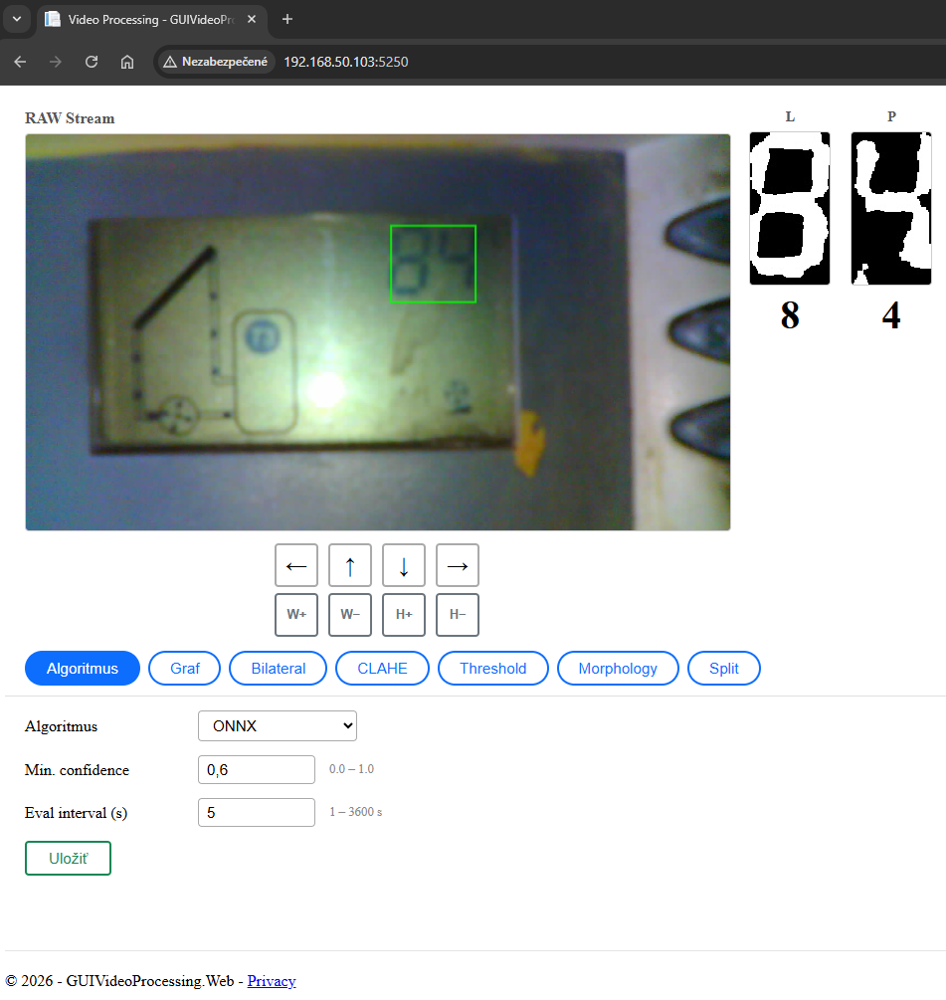
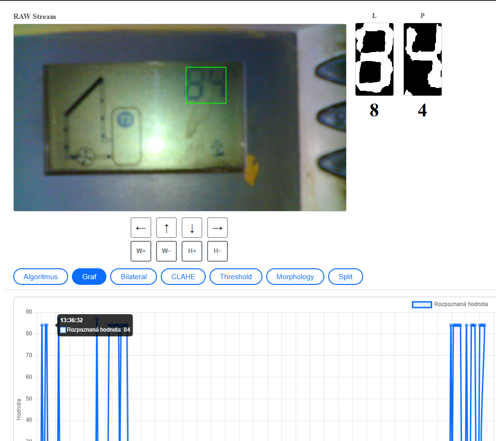
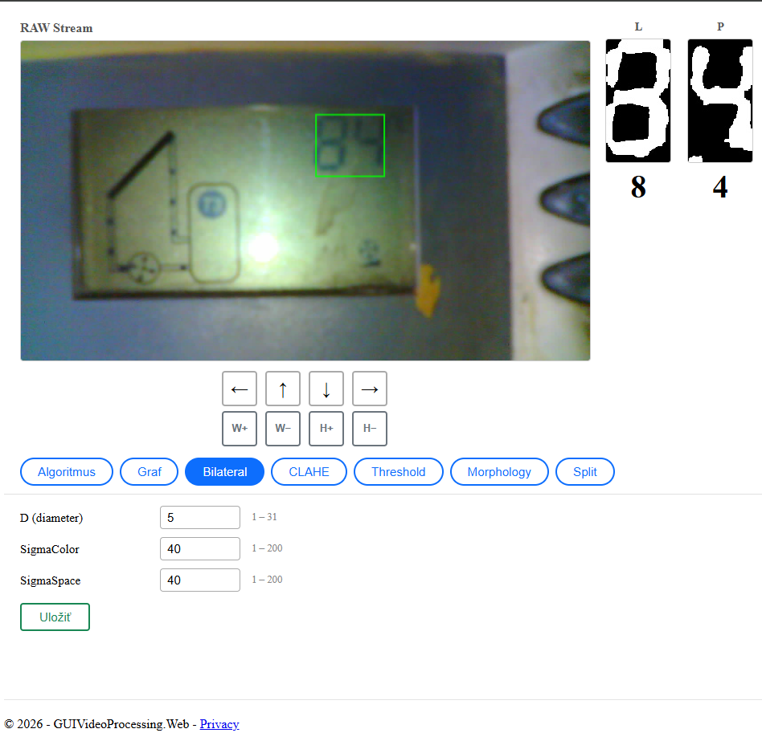
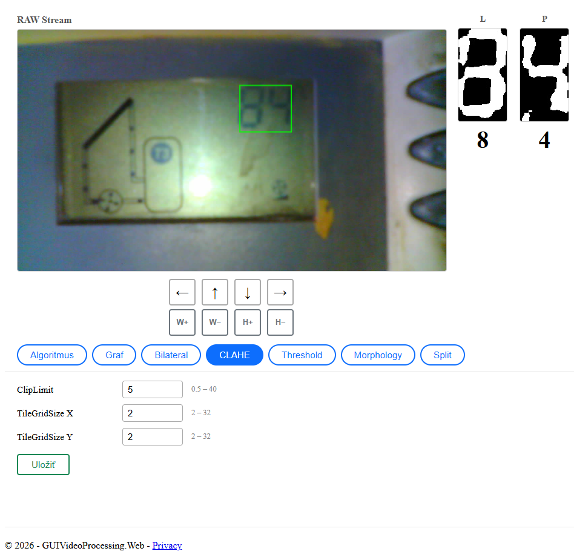
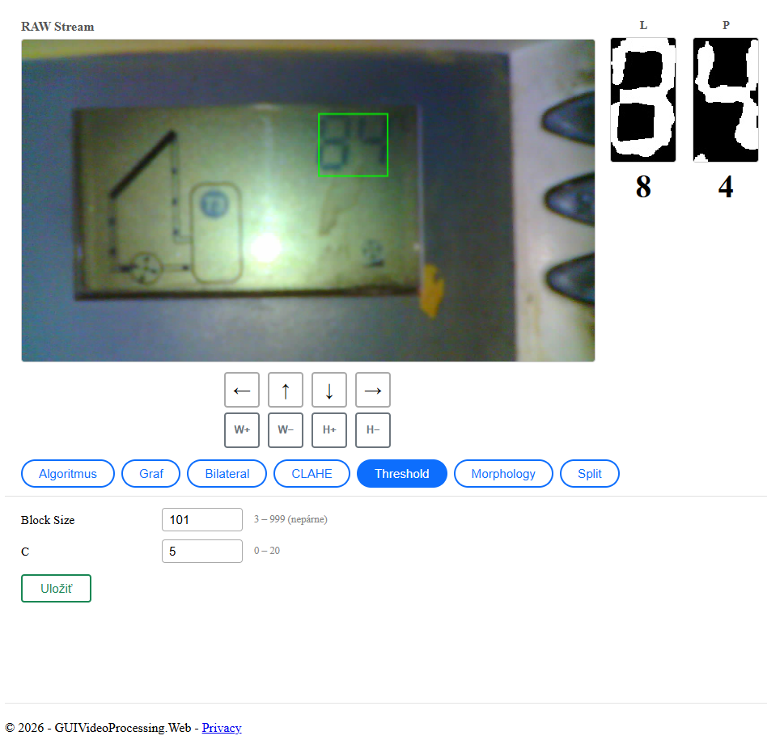
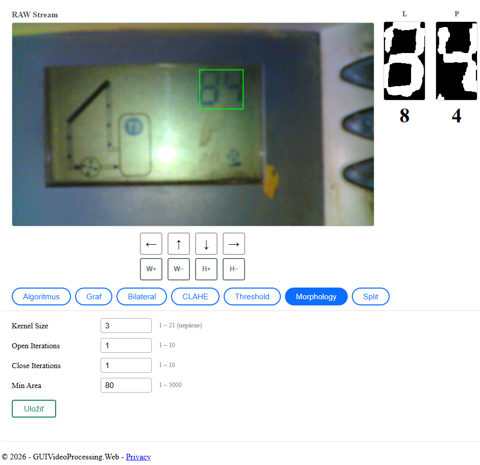
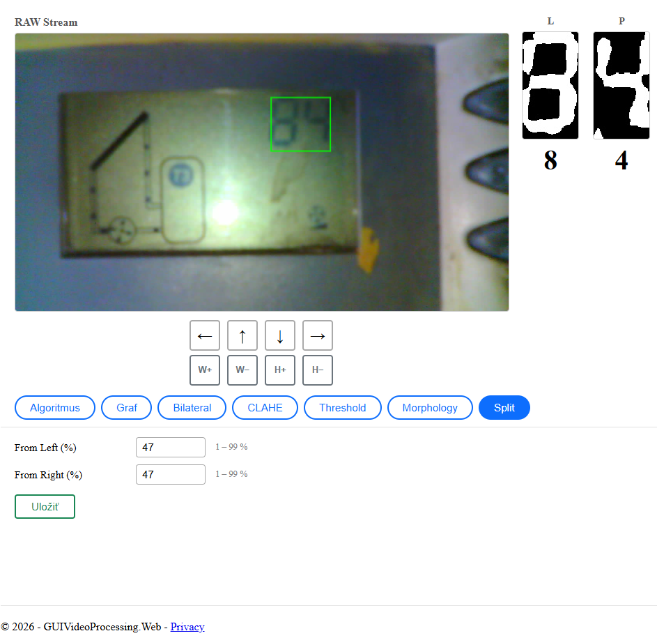
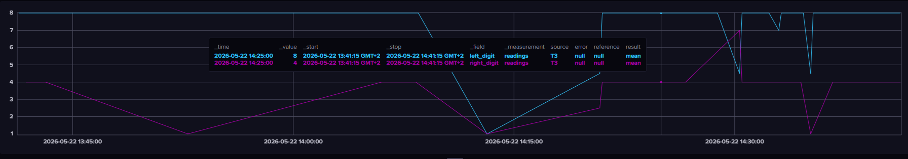

# GUIVideoProcessing.Web

ASP.NET Core webová aplikácia pre spracovanie MJPEG video streamu z ESP32-CAM kamery. Rozpoznáva číslice na 7-segmentovom displeji pomocou ONNX neurálnej siete alebo algoritmického SevenSegment dekódera. Výsledky zobrazuje v reálnom čase cez SignalR a zapisuje do InfluxDB.

## Technológie

- **ASP.NET Core 9** — web framework
- **OpenCvSharp4** — spracovanie obrazu (filter, threshold, morphology)
- **ONNX Runtime** — inference neurálnej siete
- **SignalR** — real-time push notifikácie do prehliadača
- **InfluxDB** — ukladanie časových radov rozpoznaných hodnôt
- **Serilog** — logovanie do konzoly a súborov
- **Docker / Ubuntu 22.04** — nasadenie

## Dokumentácia

Podrobná dokumentácia sa nachádza v priečinku [`docs/`](docs/):

- [`docs/dokumentacia.html`](docs/dokumentacia.html) — nasadenie, Dockerfile, appsettings.json, logy, Code Update
- [`docs/architektura.html`](docs/architektura.html) — architektúra kódu, popis všetkých tried, pipeline, GUI, API endpointy

## Screenshots

### Algoritmus

### Graf

### Bilateral

### CLAHE

### Threshold

### Morphology

### Split

### InfluxDB

